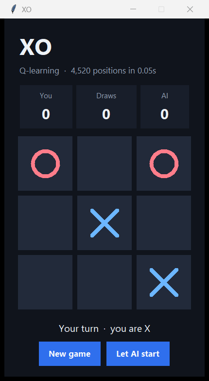

# XO

Tic-tac-toe (XO) for Windows. The opponent learns a Q-value for every legal board, then plays the best move.



Training covers 4,520 positions and finishes in a fraction of a second. Careful play ends in a draw. A mistake that gives away the game is punished.

## Run

Python 3 is the only requirement. The game uses the standard library.

Double-click `Play XO.bat`, or from this folder:

```bat
python xo_game.py
```

You play as X. **New game** starts over. **Let AI start** switches you to O. Wins, draws, and losses stay on the score line for the session.

## Opponent

Each square filled is one step, so the game is a short acyclic graph. One backward sweep sets the action value of every legal position:

| Outcome | Value |
| --- | --- |
| Win | +1 |
| Draw | 0 |
| Loss | -1 |

The AI picks a move with the highest value. When several moves tie, it chooses one of them at random.
